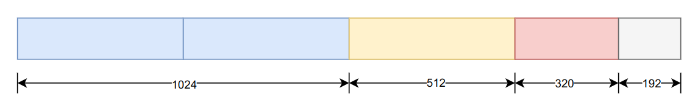
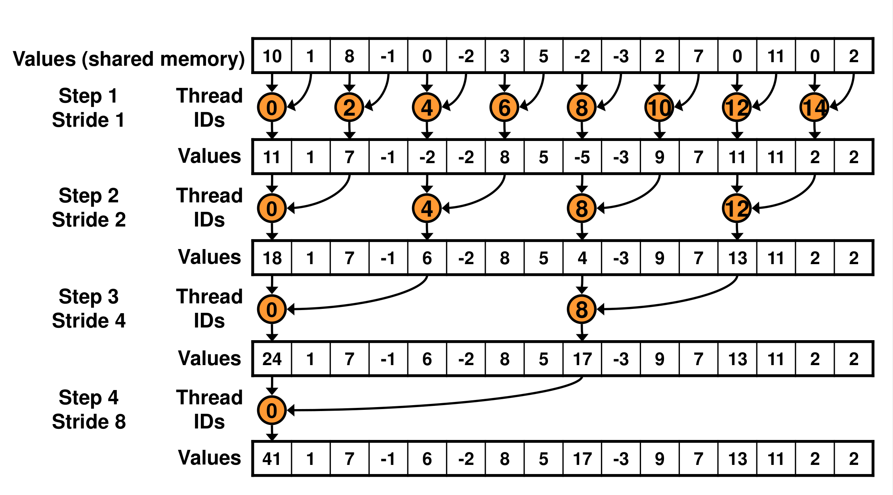
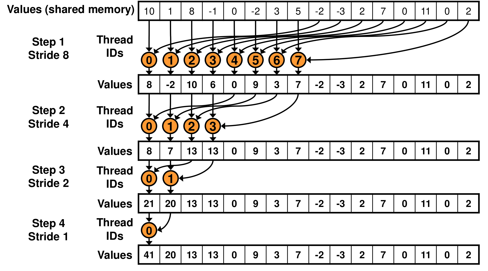

# CUDA Reduction 
The section demostrates the add reduction in CUDA. The divide-and-conquer algorithm is used at the top level to sperate any aribitary length of the input vector into the power-of-2 length sub questions which will be solved by the reduction. There are 6 reduction kernels from reduce0 to reduce5. Each version imporves on the previous. 

To assess the efficacy and performance of the CUDA-based reduction methodology, rigorous performance tests were conducted on large-scale vectors. The outcomes of these tests revealed compelling results, showcasing a substantial enhancement in computational efficiency compared to conventional CPU-based approaches. Notably, the most optimized CUDA reduction implementation demonstrated a remarkable improvement, achieving nearly a hundredfold acceleration in processing speed over the CPU baseline.

## Build & Run
```shell
cd reductionadd
make build
./reductionadd.exe -r 0 -s 509600000
```
The "-s" parameter indicates the input vector length  and "-r" means which reduce function to run from 0 to 5.

## Top Level Algorithm
The division and conquering technique implemented in the framework partition the input vector, enabling more efficient processing through parallelization. By segmenting the data into smaller, manageable subsets, the reduction kernels iteratively operate on these subsets, culminating in the aggregation of results towards the final output.

The CUDA block size is recommended to be a multiple of 32 (i.e., $N=512$ in our implementation).

Consider an input vector of length $n=1856$. According to our implementation, we divide the input vector into three sub-problems as follows:

1. sub-problem 1: input array of length $1024$, solved by two blocks of size $N=512$ each;
2. sub-problem 2: input array of length $512$, solved by one block of size $N=512$;
3. sub-problem 3: input array of length $320$, padded with $192$ zeros to extend it to length $512$, solved by one block of size $N=512$.

The final result is obtained by summing up the outputs of these three sub-problems.




## Reduction Algorithm
There are six reduction algorithms discussed in this section, ranging from the naive implementation to the most sophisticated one. You can experiment with each version by using the '-r' option.


### The Naive Version: reduce0

Add reduction are common. In CUDA context, threads run in parallel adding the neigbor value in s distance to itself. 



```cpp
__global__ void reduce0(int *g_idata, int *g_odata) {
    extern __shared__ int sdata[];
    // each thread loads one element from global to shared mem
    unsigned int tid = threadIdx.x;
    unsigned int i = blockIdx.x * blockDim.x + threadIdx.x;
    sdata[tid] = g_idata[i];
    __syncthreads();
    // do reduction in shared mem
    for(unsigned int s=1; s < blockDim.x; s *= 2) {
        if (tid % (2*s) == 0) {
            sdata[tid] += sdata[tid + s];
        }
        __syncthreads();
    }
    // write result for this block to global mem
    if (tid == 0){
        g_odata[blockIdx.x] = sdata[0];
        // printf("result=%d\n", sdata[0]);
    }
}
```
The above code is inefficient since the threads are divergent and "%" operator is very slow in the if clause.
```cpp
if (tid % (2*s) == 0)
```

### Non-divergent Version: reduce1

Replace the code
```cpp
if (tid % (2*s) == 0) {
    sdata[tid] += sdata[tid + s];
}
```
with
```cpp
int index = s * tid * 2;
if (index < blockDim.x) {
    sdata[index] += sdata[index + s];
}
```
However the non-divergent has serious bank-conflict problem in early stage of the for loop, especially when s = 1, 3. When s=1, for example, it incures a 2-way bankconfilct. ie. $$GCD(32, (1+1)mod32) = 2$$.

### Sequential Addressing: reduce2

To alleviate bank conflicts in early stages we can use sequential addressing stratage.



```cpp
__global__ void reduce2(int *g_idata, int *g_odata) {
    extern __shared__ int sdata[];
    // each thread loads one element from global to shared mem
    unsigned int tid = threadIdx.x;
    unsigned int i = blockIdx.x * blockDim.x + threadIdx.x;
    sdata[tid] = g_idata[i];
    __syncthreads();
    // do reduction in shared mem
    for(unsigned int s = blockDim.x / 2; s > 0; s >>= 1) {
        if(tid < s)
            sdata[tid] += sdata[tid + s];
        
        __syncthreads();
    }
    // write result for this block to global mem
    if (tid == 0) {
        g_odata[blockIdx.x] = sdata[0];
    }
}
```
Note that the blockDim.x is 1024.  So $s = 512$ at the beginning of the loop. $$GCD(32, (512 + 1)mod32) = 1$$, ie. no bank conflict. Every thread works in their own lane within a warp.

However, according to the experiments on GeForce 4060, the runing time of reduce2 and reduce1 are too close to tell which is better. Maybe the bank conflict problem has been optimized by morden GPUs.

We notice that half threads are idle at the beginning of the loop, which is ineffective.

### Aggressive Loading: reduce3
The reduce function can still be imporved by aggrssive loading. We can add the two values when load to shared memory. Simply replace the code
```cpp
sdata[tid] = g_idata[i];
__syncthreads();
// do reduction in shared mem
for(unsigned int s=blockDim.x / 2; s > 0; s >>= 1) {
```
with
```cpp
sdata[tid] = g_idata[i] + g_idata[i + blockDim.x / 2];
__syncthreads();
// do reduction in shared mem
for(unsigned int s=blockDim.x / 4; s > 0; s >>= 1) {
```

### Unrolling: reduce4
We can further imporve the it by unrolling the loop, since the loop control parameters and instructions are overhead.

```cpp
#pragma unroll
for (unsigned int s = N / 4; s > 0; s >>= 1) {
```

Note that for this pragma to work, N must be a const value so that the compiler can infer the loop number.

### Unrolling Last Warp: reduce5
Consider when $s<=32$, there are only first 32 threads working, and they are in the same warp. That means all the threads in the same warp executes in order so we need not to synchronize them and chose the active threads with "if" clause. 

```cpp
__device__ void warpReduce(volatile int* sdata, unsigned int tid) {
    sdata[tid] += sdata[tid + 32];
    sdata[tid] += sdata[tid + 16];
    sdata[tid] += sdata[tid + 8];
    sdata[tid] += sdata[tid + 4];
    sdata[tid] += sdata[tid + 2];
    sdata[tid] += sdata[tid + 1]; 
}

__global__ void reduce5(int *g_idata, int *g_odata) {
    extern __shared__  int sdata[];

    unsigned int tid = threadIdx.x;
    unsigned int i = blockIdx.x * blockDim.x + threadIdx.x;

    // Load element from global memory to shared memory
    sdata[tid] = g_idata[i] + g_idata[i + blockDim.x / 2];
    __syncthreads();

    // Perform reduction in shared memory using a binary tree approach
    #pragma unroll
    for (unsigned int s = N / 4; s > 32; s >>= 1) {
        if (tid < s) {
            sdata[tid] += sdata[tid + s];
        }
        __syncthreads();
    }

    if (tid < 32) {
        warpReduce(sdata, tid);
    }
    // Write result for this block to global memory
    if (tid == 0) {
        g_odata[blockIdx.x] = sdata[0];
    }
}
```

Note that the volatile key word is used to tell the compiler do not optimize so that the operation on the memory is restrictly as it ought to be, if the threads in the warp are non-divergent. However, the order of execution of sub-warps after a warp-divergence is UNDEFINED.


## Performance
Experiments were conducted on a laptop with an Intel i9 13900 CPU, 96GB RAM, and GeForce 4060 GPU with 8GB device RAM. The total length of the vector to sum up is 509,600,000 bytes.

| Functions | Avg Time(ms) | Strategy|
|-----------|--------------|---------|
| reduce0| 29.29|   Naive        |
| reduce1| 20.31|  Non-divergent |
| reduce2| 19.50|Sequential Addressing|
| reduce3| 18.25|Aggressive Loading|
| reduce4| 16.91|Unrolling: reduce4|
| reduce5| 11.75|Unrolling Last Warp|
| CPU baseline| 1025| Loop Add|

The performance gains of adopting non-divergent and unrolling-last-warp strategies are significant, whereas others show slight improvements. All the reductions running on GPU are much faster than on CPU, with the most nearly 100 times faster and 35 times, the least.

## Reference
https://developer.download.nvidia.cn/assets/cuda/files/reduction.pdf

https://stackoverflow.com/questions/22939034/block-reduction-in-cuda/31730429#31730429
